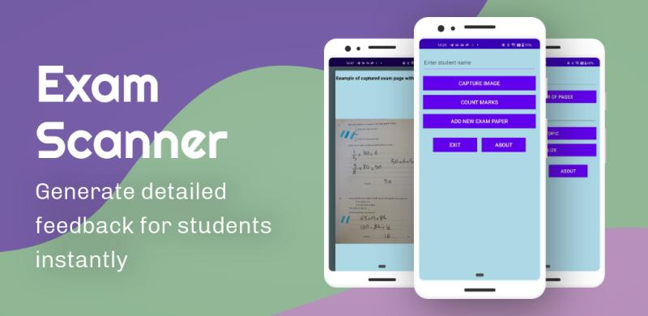
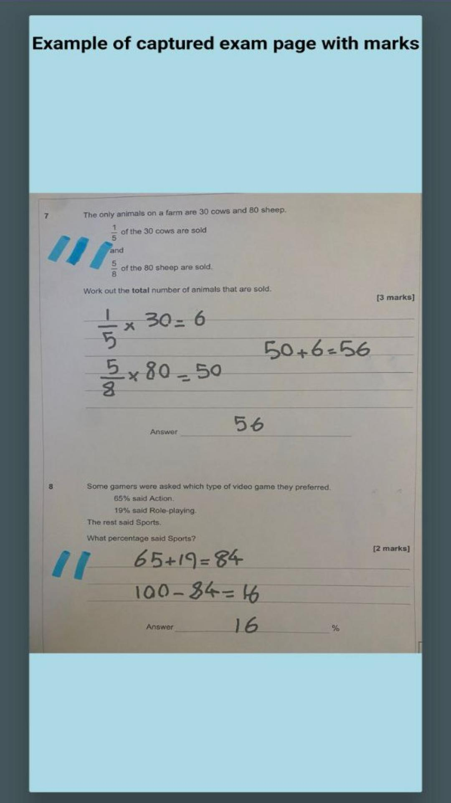
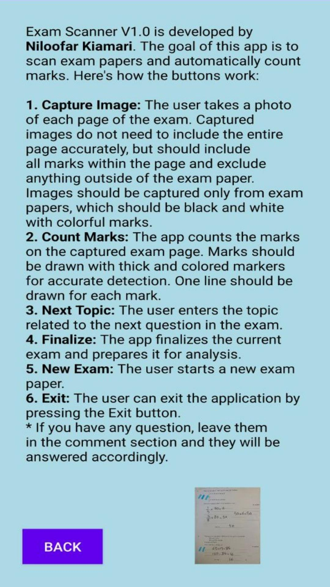

# Exam Scanner V1.0

<b>Developed by:</b> Niloofar Kiamari  
  

<b>Exam Scanner V1.0</b> is a mobile Android application designed to automate the feedback process by analyzing exam papers and generating detailed feedback reports.  
This tool enhances feedback efficiency by significantly reducing feedback time and improving the overall quality of feedback provided to students.
  

---

## <b>App Description</b>

<b>Exam Scanner V1.0</b> streamlines the process of providing detailed feedback to students by scanning exam papers and automatically counting marks related to each topic.  
  

Here's how the buttons work:
  

<b>1. Capture Image:</b>  
The user takes a photo of each page of the exam.  
Captured images do not need to include the entire page accurately but should include all marks within the page and exclude anything outside of the exam paper.  
Images should be captured only from exam papers, which should be black and white with colorful marks.  
  

<b>2. Count Marks:</b>  
The app automatically counts the marks related to each topic on the captured exam page.  
Marks should be drawn with thick and colored markers for accurate detection.  
One line should be drawn for each mark.  
  

<b>3. Next Topic:</b>  
The user enters the topic corresponding to each question in the exam.
  

<b>4. Finalize:</b>  
The app finalizes the current exam and prepares it for analysis.  
  

<b>5. New Exam:</b>  
The user starts a new exam paper.  
  

<b>6. Exit:</b>  
The user can exit the application by pressing the Exit button.  
  

---

## <b>Features</b>

- Capture multiple pages of exams  
- Detect and count marks per topic automatically  
- Export results to Excel for feedback reports  
- Simple and intuitive user interface  
- Quick setup for multiple exams  

---

## <b>Tech Stack</b>

- <b>Android (Java)</b>  
- <b>OpenCV</b> for image processing  
- <b>JXL</b> for Excel report generation  
  

---

## <b>How It Works</b>

1. Enter the number of pages for the exam and the topics of each question.  
2. Capture images of each exam page using the app.  
3. The app uses computer vision to detect and count marks.  
4. Export the results as an Excel file for detailed feedback.  
  

---

## <b>Future Improvements</b>

- OCR-based student name detection  
- Cloud storage for exam data  
- AI-assisted grading and feedback  
  

---

## <b>Screenshots</b>

### Cover

  
  

  
  

  

---

## 🎥 Demo Video
[Download Demo (MP4)](https://github.com/nilookiamari/Exam_Scanner/releases/download/V1.0/demo.mp4)

---
## <b>License</b>

This project is licensed under the <b>MIT License</b>.  

